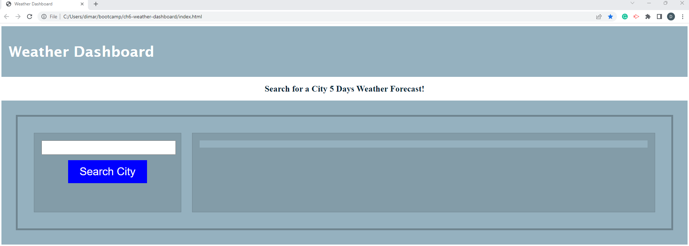

# Server-Side APIs: Weather Dashboard

## Description
I have built a  Weather dashboard that will run in the browser and feature dynamically updated HTML and CSS the weather forecast data for a selected city, retrieving data from the openweathermap.org APIs.I have built a  Weather dashboard that will run in the browser and feature dynamically updated HTML and CSS the weather forecast data for a selected city, retrieving data from the openweathermap.org APIs.

  

## Table of Contents
- [Installation](#installation)
- [UserStory](#userstory)
- [Credits](#credits)
- [Tests](#tests)
- [Email](#email)
- [GitHub](#github)
- [License](#license)
- [DeployedURL](#deployedurl)

## Installation
Clone to your local computer the ch6-weather-dashboard application located in my remote repository at https://github.com/dimartoro/ch6-weather-dashboard.git for the code details. Below you'll find the URL of my deployed application with the details of the application's functionality.

## UserStory
AS A traveler  
I WANT to see the weather outlook for multiple cities  
SO THAT I can plan a trip accordingly  
Acceptance Criteria    

GIVEN a weather dashboard with form inputs  
WHEN I search for a city  
THEN I am presented with current and future conditions for that city and that city is added to the search   history  
WHEN I view current weather conditions for that city  
THEN I am presented with the city name, the date, an icon representation of weather conditions, the   temperature, the humidity, and the wind speed  
WHEN I view future weather conditions for that city  
THEN I am presented with a 5-day forecast that displays the date, an icon representation of weather   conditions, the temperature, the wind speed, and the humidity  
WHEN I click on a city in the search history  
THEN I am again presented with current and future conditions for that city  

## Credits
none

## Tests
Accomplishing the user criteria will successfully test the application.  
P1. Weather Dashboard, Search Desired City:           
         
P2. Weather 5 Days Forecast of Charlotte, the selected city:            
       
P3. List of Cities searched validating persistent data functionality:          
      

## Email
Contact me with additional questions at this email address:

dimartoro@gmail.com

## GitHub
https://github.com/dimartoro

## License
This app is licensed under [MIT](https://choosealicense.com/licenses/mit/) lincense

## DeployedURL
https://drive.google.com/file/d/1Ic14KwgC7xy8tJC7A5SB_llg_hcsXhf1/view

